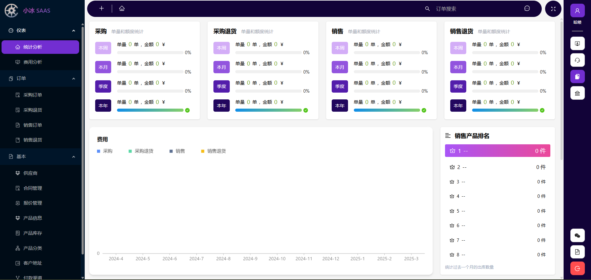

# 🚀 SaaS System Project

---

## 📖 Project Introduction

This project is a **SaaS system** independently developed by me during my entrepreneurial period, aiming to provide comprehensive management solutions for enterprises. The main features of the system include:

- **📦 Inventory Management Service**: Helps enterprises efficiently manage the procurement, sales, and inventory of goods.
- **🏭 Warehouse Management Service**: Provides detailed management of warehouses, supporting functions such as inventory counting and location management.
- **🤖 AI Customer Service**: Offers intelligent customer service through AI technology to enhance customer experience.

The system supports multiple platforms, including:

- **🌐 Web**
- **📱 WeChat Official Account**
- **📲 H5**
- **📟 Android PDA**

The project has successfully integrated with multiple third-party platforms, including:

- **WeChat Official Account**
- **WeChat Pay**
- **Alipay**
- **Kuaidi 100 Logistics**

**🎥 Product Demo**: [Click to view the demo](http://120.26.12.57/pc/login/admin)

---

## 🛠 Code Structure Introduction

### Ice.Micro

This is the backend project, providing APIs for the frontend. It is developed based on .NET ABP and adopts the DDD design pattern. The design diagram is available at `docs/Ice Micro.vsdx`.

### Ice.MicroFront

This is the frontend project, including PC, H5, and PDA. It is written based on React, Redux, and React Router.

For instructions on how to run this project, please refer to the `README` file in the corresponding directory.

### Ice.WebSite

This is the official website, written based on Next.js.

### Design

This project is modularly designed. If you do not want a certain design, you can delete the corresponding module directory and then remove the reference.

---

## Finally

This code is no longer maintained. Please do not leave comments.