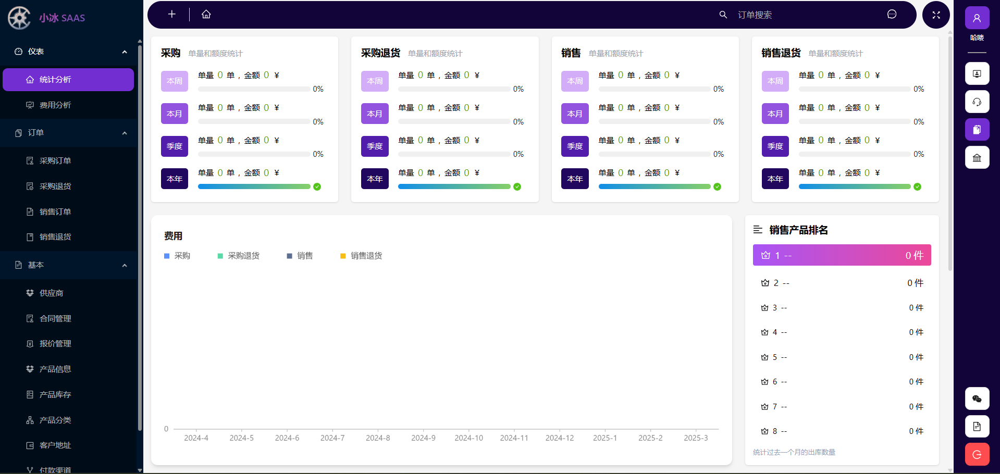

# 🚀 SaaS 系统项目

---

## 📖 项目介绍

本项目是我在创业期间自主开发的 **SaaS 系统**，旨在为企业提供全面的管理解决方案。系统主要功能包括：

- **📦 进销存服务**：帮助企业高效管理商品的采购、销售和库存。
- **🏭 仓库管理服务**：提供仓库的精细化管理，支持库存盘点、货位管理等功能。
- **🤖 AI 客服**：通过 AI 技术提供智能客服服务，提升客户体验。

系统支持多平台使用，包括：

- **🌐 Web 端**
- **📱 微信公众号**
- **📲 H5**
- **📟 安卓 PDA**

项目已成功对接多个第三方平台，包括：

- **微信公众号**
- **微信支付**
- **支付宝支付**
- **快递 100 物流**

**🎥 产品演示**：[点击查看演示](http://120.26.12.57/pc/login/admin)

---

## 🛠 代码结构介绍

### Ice.Micro

这是后端项目，为前端提供 API，基于 .net ABP 开发，采用 DDD 的设计模式，设计图为 docs/Ice Micro.vsdx。

### Ice.MicroFront

这是前端项目，包含 PC、H5、PDA，基于 React、Redux、React route 编写。

如何运行这个项目请查看对应目录的 readme 文件。

### Ice.WebSite

这是官网，基于 nextjs 编写。

### 设计

这个项目都是模块化的设计，如果你不想要某个设计，可以删除对应的模块目录，然后去除引用即可

---

## 最后

该代码不再维护，不要留言了

